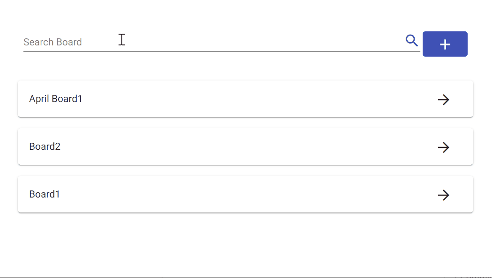
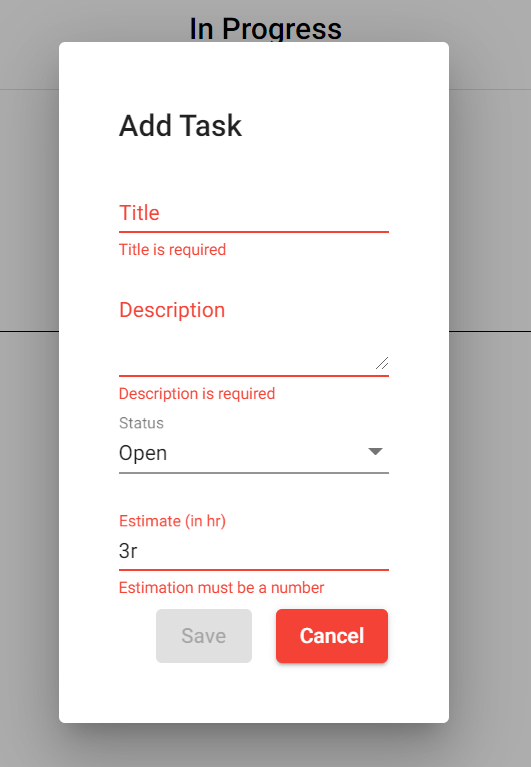
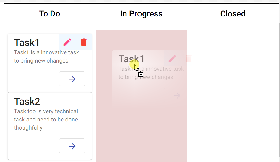

# Kanbanboard


This project is build with firebase database and angular. It demonstrate basic crude operations with firebase database.

## Add/Edit Form
Add/Edit form used for adding new items to board and also used for updating existing items. It is build on reactive form apis of angular which is utilising validations and observers apis to maintain data consistency while feeding values in different fields.


## Change status by drag and drop to respective list


## Technology used for creating this project
* RxJs
* Firebase database
* Reactive forms
* HTML drag and drop
* CSS Flexbox

## Build
* Create your own project in firebase and replace firebase api keys in environment.ts file
```typescript

export const environment = {
  ...
  firebaseConfig: {
    apiKey: "<api_Key>",
    authDomain: "<auth_Domain>",
    projectId: "<project_id>",
    storageBucket: "<storage_bucket>",
    messagingSenderId: "<messaging_sender_id>",
    appId: "<app_id>",
    measurementId: "<measurement_id>"
  }  
};
```
* Run `ng build` to build the project. The build artifacts will be stored in the `dist/` directory.

## Hosted url of application
Application is deployed on firebase. To see running application click [here](https://kanbanboard-ca277.web.app/)
